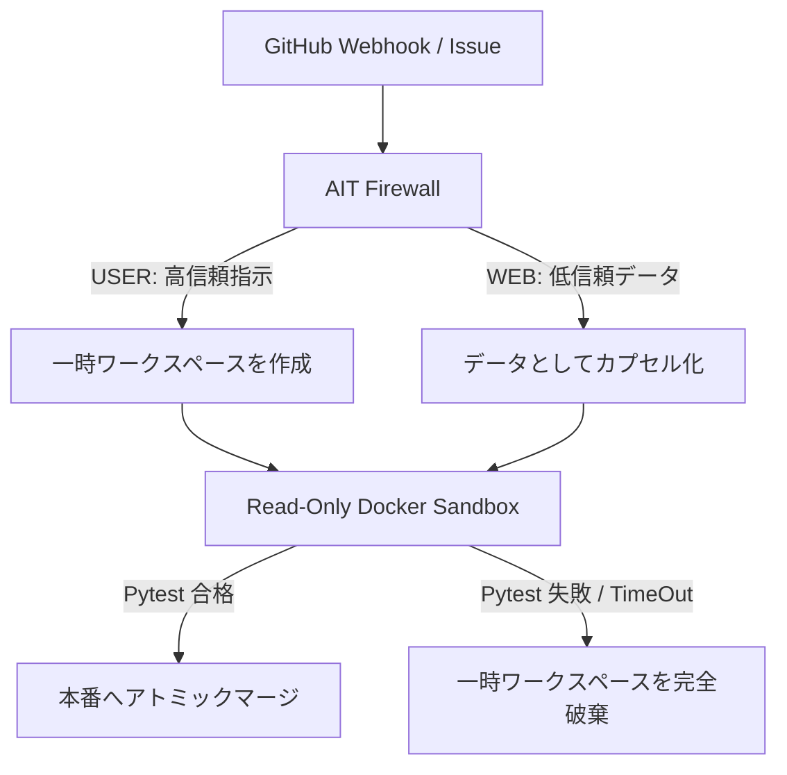

# CPOS Engine-Zero: Zero-Trust Autonomous DevOps Agent Platform

**DevOps x AI Agent Hackathon 2026 提出作品**

Engine-Zero は、自律型 AI エージェント（コード自動修正・DevOpsサイクル）の実務導入における「セキュリティ（ゼロトラスト）」と「開発の自由度（完全並列・柔軟な命令）」を両立した、次世代の DevOps エージェント・プラットフォームです。

---

## 📺 デモ解説動画 (YouTube)
実機コンソールデモと仕組みの漫才解説動画：  
🎥 **[YouTube デモ動画を視聴する](https://www.youtube.com/watch?v=k8KWmq11De8)**  
🎥 **ローカルデモ動画ファイル:** [engine_zero_demo_20260707_003348.mp4](engine_zero_demo_20260707_003348.mp4) (直接ダウンロードして再生可能)

---

## 🛡️ 主要セキュリティアーキテクチャ

Engine-Zero は、AIが生成するコードや悪意ある外部のインジェクションから本番リポジトリとホストOSを守るため、**Defense-in-Depth（多層防御）**を採用しています。現在の提出版は division-by-zero 修正を題材にした hackathon demo fixture で、修正器はポリシー駆動で拡張できる構成です。



### 1. AIT Firewall（命令とデータの完全分離）
* **仕組み:** 入力ソース（`USER` や `WEB`）を隔離された `[DATA]` タグでカプセル化。特殊トークン（`</s>` や `<|im_start|>` 等）の完全サニタイズと大文字小文字無視エスケープにより、AIの文脈脱出（境界突破）を効果的に防止します。
* **メリット:** AIへのプロンプトインジェクションによる「意図しないコード修正」の発生確率を大幅に低減します。

### 2. Parallel Dynamic Workspaces（完全並列実行）
* **仕組み:** Webhook 受信ごとに、本番リポジトリを `target_app_tmp_<UUID>` へ動的にコピー。検証処理は個別ワークスペースで完全並行に実行します。
* **Deploy安全性:** 本番ファイルへの反映時のみプロセス内ロックと `os.replace()` によるアトミック置換を使い、並列Webhookの競合書き込みを防ぎます。
* **メリット:** 複数人の開発者が同時に Issue を投げても、検証段階は干渉せず高速に並列処理できます。

### 3. Hyper-Isolated Sandbox（超隔離コンテナによる防御）
* **仕組み:** テストコードの自動実行（`pytest`）時、Docker コンテナへ一時ディレクトリを**読み取り専用（`ro`）でマウント**し、さらに以下の制限を強制します：
  - **`--network none`**: ネットワーク通信を完全遮断（リバースシェル・情報流出防止）。
  - **`--cap-drop=ALL`**: カーネル特権を全て剥奪（コンテナエスケープ防止）。
  - **`--memory 512m` / `--cpus 0.5` / `--pids-limit 50`**: リソース制限（DoS・Fork Bomb 防止）。
* **Fail Closed:** Docker が利用できない場合はデフォルトで検証失敗として停止します。ローカル発表デモだけ `ENGINE_ZERO_ALLOW_LOCAL_FALLBACK=1` を指定すると、30秒タイムアウト付きの reduced-isolation ローカル検証を明示的に許可できます。
* **メリット:** 検証対象コードに悪意ある破壊コマンドやコンテナ突破エクスプロイトが含まれていても、ホストOSやネットワークへの悪影響を徹底的に防止します。30秒のタイムアウト時にはコンテナを強制終了（Kill）してゾンビ化を防ぎます。

### 4. Portable Malware & Backdoor Scanner（静的マルウェア検知）
* **仕組み:** 生成されたコードのテスト検証に入る前に、エージェント内で直接シグネチャスキャンを実施します。
* **メリット:** 不正コード（`eval`/`os.system`）、難読化されたBase64ペイロード、不審なソケット接続（`socket.socket`）などのバックドア・トロイの木馬が検出された場合、テスト検証を中止して即座にデプロイを却下（アトミックロールバック）します。


### 5. GitHub Webhook Signature Gate（入口認証）
* **仕組み:** `GITHUB_WEBHOOK_SECRET` が設定されている場合、GitHub の `X-Hub-Signature-256` を HMAC-SHA256 で検証し、不一致のリクエストは `401` で拒否します。
* **運用:** Secret値はコードに書かず、Vault/Secret Manager等から実行環境へ注入してください。未設定時はローカルデモ用に受け付けますが、ログに demo mode 警告を出します。公開環境では `ENGINE_ZERO_REQUIRE_SIGNATURE=1` を設定すると、Secret未設定/署名なしを拒否できます。

---

## 📂 リポジトリ構成

* [engine_zero_server.py](engine_zero_server.py): Webhook のリクエストを非同期でキュー（ThreadPool）にスケジュールする軽量 Flask サーバー。
* [engine_zero_cli.py](engine_zero_cli.py): Webhookを起動せず、CLIから1回だけ安全なDevOpsサイクルを実行するエントリポイント。
* [engine_zero_agent.py](engine_zero_agent.py): ワークスペース複製、Speculative Fix、Docker サンドボックス検証、アトミックデプロイを行う自律エージェントのコア。
* [ait_firewall/](ait_firewall/): 入力パケットの分類・サニタイズ・ハニーポットを行う AIT 防御層。
* [cpos/core.py](cpos/core.py): 行動履歴を SHA-256 で暗号連結するハッシュチェーン追記ログモジュール。
* [Dockerfile](Dockerfile): 非特権ユーザー（`appuser`）でサーバーを動かすセキュアなコンテナ構成定義。

---

## 🚀 クイックスタート（実機テスト＆検証）

### ① AIT Firewall のセキュリティテスト実行（Pytest）
リポジトリに内包された全 9 種の攻撃シミュレーション（ゼロ幅インジェクション、スプーフィング、ロールプレイ脱出など）に対する防御テストを pytest で一度に実行できます。

```bash
# repository root から実行（redteam_v2 test helper を同梱）
PYTHONPATH=. pytest -q \
  ait_firewall/examples/genetic_evolution_test.py \
  ait_firewall/examples/inception_attack_poc.py \
  ait_firewall/examples/mirage_persistence_test.py \
  ait_firewall/examples/rcf_attack_poc.py \
  ait_firewall/examples/smuggling_attack_poc.py \
  ait_firewall/examples/spoofing_attack_poc.py \
  ait_firewall/examples/stegano_output_test.py \
  ait_firewall/examples/structural_attack_poc.py \
  ait_firewall/examples/zerowidth_attack_poc.py
```

**実行結果:**
```text
collected 9 items                                                              

examples/genetic_evolution_test.py .                                     [ 11%] (Evolving Defense)
examples/inception_attack_poc.py .                                       [ 22%] (Roleplay/Inception Attack)
examples/mirage_persistence_test.py .                                    [ 33%] (Mirage Deception Defense)
examples/rcf_attack_poc.py .                                             [ 44%] (Remote Code Execution)
examples/smuggling_attack_poc.py .                                       [ 55%] (Semantic Smuggling Attack)
examples/spoofing_attack_poc.py .                                        [ 66%] (AIT Tape Spoofing Attack)
examples/stegano_output_test.py .                                        [ 77%] (Steganographic Leak Filter)
examples/structural_attack_poc.py .                                      [ 88%] (Tag Structural Flattener)
examples/zerowidth_attack_poc.py .                                       [100%] (Zero-Width Space Stripper)

============================== 9 passed in 0.31s ===============================
```

### ② Sandbox イメージのビルド
検証用コンテナイメージを作成します。

```bash
docker build -t engine-zero-sandbox:latest .
# sandbox image uses /opt/engine-zero-venv so the read-only /app/target_app mount does not hide pytest
```


### ③ CLI から起動・1回だけ実行
引数なしで起動すると、Claude/Codex風のウェルカム画面とクイックスタートが表示されます。

```bash
python3 engine_zero_cli.py
```

Webhookを使わず、CLIから同じ Engine-Zero サイクルを実行できます。

```bash
python3 engine_zero_cli.py run \
  --instruction 'Feature Request: Handle division by zero by returning float("inf")' \
  --web-context 'safe check'
```

Docker がないローカル発表環境だけ、明示的に reduced-isolation fallback を許可できます。

```bash
python3 engine_zero_cli.py run \
  --allow-local-fallback \
  --instruction 'Feature Request: Handle division by zero by returning float("inf")'
```

### ④ Webhook サーバーの起動
非同期で並列 DevOps サイクルを回す Webhook レシーバーを起動します。

```bash
# 本番/公開Webhookでは必ず Vault 等から GITHUB_WEBHOOK_SECRET を注入してください
# 署名必須にする場合: ENGINE_ZERO_REQUIRE_SIGNATURE=1
python3 engine_zero_server.py
```

### ⑤ Webhook へのテスト送信
Issue が開かれたイベントをシミュレートして POST リクエストを送信し、自動修正サイクルをトリガーします。

```bash
curl -i -X POST -H "Content-Type: application/json" \
  -d '{"action": "opened", "issue": {"title": "Feature Request: Handle division by zero by returning float(\"inf\")", "body": "safe check"}}' \
  http://localhost:8080/webhook
```
* `GITHUB_WEBHOOK_SECRET` 未設定時はローカルデモモードとして受理します。公開環境では署名付きGitHub Webhookのみを受け付ける構成で運用してください。
* サーバーは即座に `202 ACCEPTED` を返し、裏でクローンワークスペースが生成され、Docker 内でのテストパスを経て本番コードへアトミックにマージされます。
