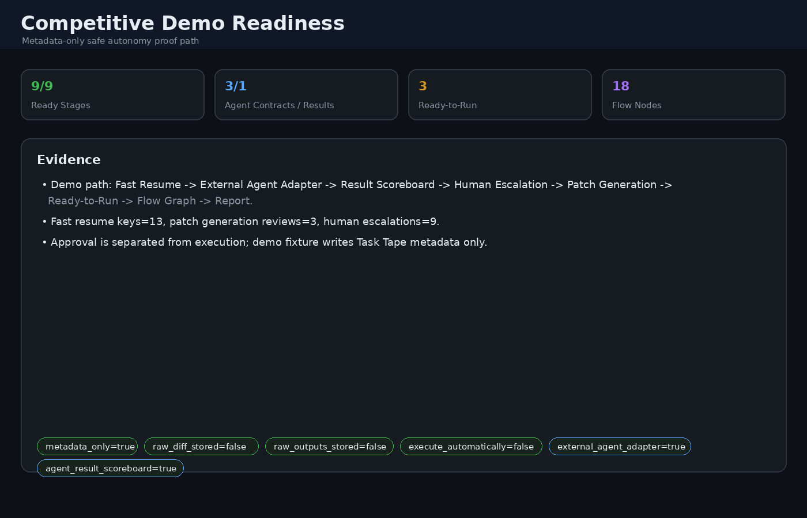
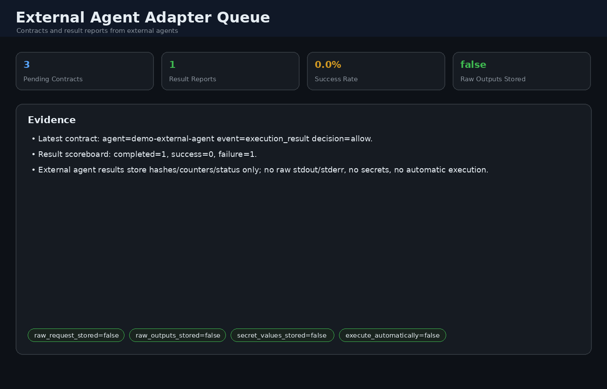
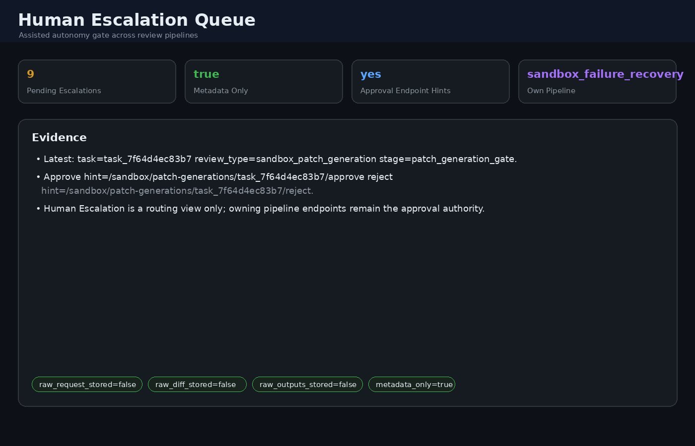
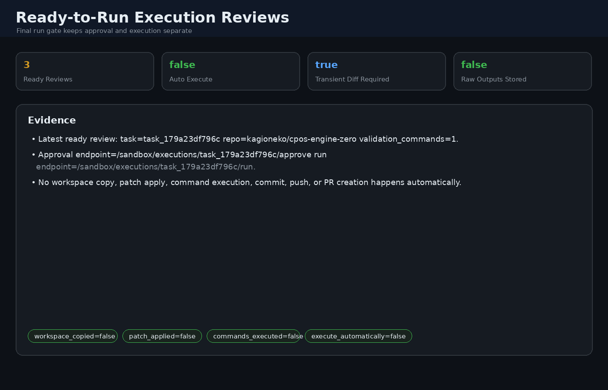
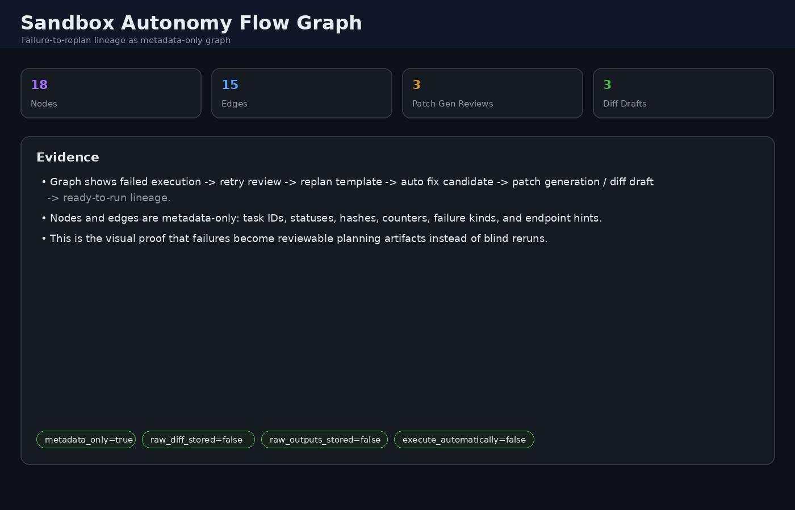
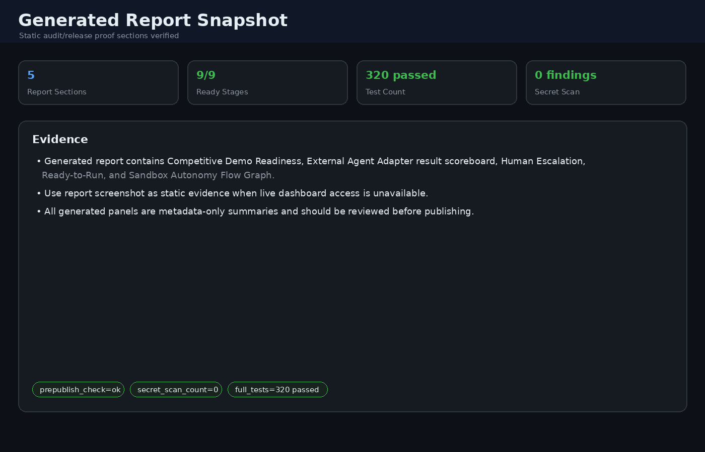

# CPOS Engine-Zero

## OSS Positioning

CPOS Engine-Zero is a defensive, memory-governed AI agent runtime for safe autonomy: it separates relationship memory, task execution, and runtime state while routing risky work through review-gated, metadata-only pipelines.

It combines Context Pointer OS, append-only Task Tape, approval-gated remediation,
tamper-evident audits, hardened API controls, governance-first MCP integration,
and a sandbox retry/replan loop that learns from failures without persisting raw
secrets, raw diffs, or raw command output.

CPOS also supports assisted autonomy: low-risk work can proceed autonomously, while
secret-touching, destructive, production, network, GitHub publishing, or low-confidence
work is routed through a human escalation protocol. See
`docs/HUMAN_ESCALATION_PROTOCOL.md`.

Current MCP support is intentionally conservative: connector definitions are
statically checked, reviewed, and registered; execution requests are dry-run /
metadata-only; capability probes create approval-gated plans. Real MCP tool
execution is not enabled by default.

See `SECURITY.md` and `OSS_RELEASE_CHECKLIST.md` before publishing or deploying.

See `docs/backlog/V0_1_1_BACKLOG.md` for post-v0.1.0 stabilization and v0.1.1 seed tasks.
See `docs/backlog/V0_1_2_BACKLOG.md` for parked post-RC ideas; implementation is not started.
See `docs/COGNITIVE_AGENT_OS_ARCHITECTURE.md` for the repo-family Cognitive Agent OS architecture draft.
See `docs/SENSOR_AND_GOAL_MANAGER_SPEC.md` for the first sensor/goal-manager spec draft.
See `docs/V0_1_1_SUMMARY.md` for the completed v0.1.1 stabilization summary.
See `RELEASE_NOTES_v0.1.1.md` and `GITHUB_RELEASE_DRAFT_v0.1.1.md` for v0.1.1 release prep drafts.
See `docs/ANNOUNCEMENT_COPY_v0.1.0.md` for reusable post-release announcement/social copy.
See `docs/LOCAL_RUNTIME_FILE_INVENTORY.md` for ignored local/runtime artifact handling.

## Quick Competitive Demo

For a local, metadata-only demo path, seed safe fixture data and inspect readiness:

```bash
# Create demo Task Tape events only; no tool execution, patch apply, commit, push, PR, or raw output storage.
curl -X POST https://<host>/demo/fixture -d '{"confirm":true,"reason":"demo_capture"}'

# Inspect Fast Resume + External Agent Adapter + Human Escalation + Patch Generation + Ready-to-Run + Flow Graph readiness.
curl https://<host>/demo/readiness
```

Then open the dashboard and capture **Competitive Demo Readiness**, **External
Agent Adapter Queue / Result Scoreboard**, **Human Escalation Queue**,
**Patch Generation Reviews**, **Ready-to-Run Execution Reviews**, and **Sandbox
Autonomy Flow Graph**. The same evidence appears in the generated report. For
capture order and safety rules, see `docs/DEMO_CAPTURE_GUIDE.md`.

Demo evidence assets are metadata-only screenshots/panels; they show hashes,
counts, endpoint hints, statuses, and safety flags, not raw diffs, raw outputs,
request bodies, or secrets.



| External Agent Adapter | Human Escalation | Ready-to-Run | Flow Graph |
|---|---|---|---|
|  |  |  |  |



## Core Capabilities
- Context Pointer OS for lightweight memory references and retrieval governance
- Append-only Task Tape with checkpoints and rollback support
- Approval-gated remediation for sensitive or irreversible actions
- Tamper-evident hash-chained audit logs
- Defensive MCP connector registry, review queue, dry-run execution, and capability probes
- HMAC, bearer-token, HTTPS, mTLS fingerprint, IP allowlist, and rate-limit controls
- Sandbox policy modes and security profile validation

## Architecture at a Glance

```text
User / Agent Input
        |
        v
+---------------------+
| Context Router      |  classify: relationship / task / hybrid / dangerous
+---------------------+
        |
        +-------------------+-------------------+--------------------+
        |                   |                   |                    |
        v                   v                   v                    v
+----------------+  +----------------+  +----------------+  +----------------+
| Context Pointer|  | Task Tape      |  | State / Runtime|  | Security Gates |
| OS             |  | append-only    |  | short-lived    |  | auth/policy    |
| relation refs  |  | rollback/audit |  | no persistence |  | review first   |
+----------------+  +----------------+  +----------------+  +----------------+
        |                   |                   |                    |
        +-------------------+-------------------+--------------------+
                            |
                            v
+-----------------------------------------------------------------------+
| Review-Gated Execution Pipeline                                      |
| PR dry-run -> diff review -> sandbox plan -> execution review -> run |
| -> result metadata -> retry review -> replan template -> diff intake |
+-----------------------------------------------------------------------+
                            |
                            v
+-----------------------------------------------------------------------+
| Persistence Boundary                                                  |
| Store: hashes, sizes, statuses, pointers, audit metadata              |
| Never store: secrets, raw stdout/stderr, raw diff, request bodies     |
+-----------------------------------------------------------------------+
```

CPOS keeps relationship/context memory, task execution history, and short-lived
runtime state separate. Cross-layer context is injected only through governed
pointers and review-gated Task Tape events, which keeps long-term memory from
being polluted by failed commands or transient execution state.

## Safe Autonomy Demo Flow

CPOS Engine-Zero is designed around a conservative autonomy loop: every risky
step is review-gated, raw secrets and raw command outputs stay out of persistent
logs, and failed runs turn into metadata-only retry/replan artifacts instead of
blind automatic reruns.

```text
GitHub PR dry-run
  -> GitHub diff review
  -> Sandbox patch plan
  -> Sandbox execution review
  -> Isolated sandbox run
  -> Completed result metadata
  -> Retry review
  -> Replan template
  -> Diff intake checklist
  -> Auto Fix Candidate
  -> Diff Review Draft
  -> Human-supplied GitHub diff review
  -> Back to sandbox execution
```

Key safety properties:

- No branch, commit, push, or PR is created by these planning/review stages.
- Raw diff text is accepted for review/run input but is not persisted in Task Tape.
- Raw stdout/stderr are never persisted; only hashes, sizes, exit codes, and status flags are stored.
- Validation commands are allowlisted and shell metacharacters are rejected.
- `local-dev` runner mode requires explicit `CPOS_ALLOW_LOCAL_DEV_RUN=true`.
- Failure routing uses `patch_apply`, `validation_command`, `sandbox_unavailable`, and `policy_rejected`.
- Runtime state, caches, virtualenvs, and secret files are ignored and must not be committed.

Minimal metadata-only loop:

```bash
curl -X POST https://<host>/github/pr-dry-runs \
  -d '{"repo":"kagioneko/cpos-engine-zero","title":"Fix behavior","summary":"metadata only","files":["README.md"]}'
curl -X POST https://<host>/github/pr-dry-runs/<pr_task_id>/create-diff-review \
  -d '{"diff_text":"...","changed_files":["README.md"],"validation_commands":["pytest -q tests/test_report.py"]}'
curl -X POST https://<host>/github/diff-reviews/<diff_task_id>/create-sandbox-plan -d '{}'
curl -X POST https://<host>/sandbox/patch-plans/<patch_task_id>/create-execution-review -d '{}'
curl -X POST https://<host>/sandbox/executions/<exec_task_id>/run \
  -d '{"diff_text":"...","validation_commands":["pytest -q tests/test_report.py"],"runner_mode":"strict"}'
curl -X POST https://<host>/sandbox/executions/<exec_task_id>/create-retry-review \
  -d '{"reason":"validation_failed"}'
curl -X POST https://<host>/sandbox/execution-retries/<retry_task_id>/create-replan-template \
  -d '{"reason":"make_new_plan"}'
curl -X POST https://<host>/sandbox/replan-templates/<replan_task_id>/create-diff-intake \
  -d '{"reason":"next_diff"}'
```

The dashboard surfaces each queue/result: PR dry-run, diff review, sandbox plan,
execution review, completed execution result, retry review, replan template, diff
intake, auto fix candidate, diff review draft, and sandbox flow graph.

### Autonomy Loop Demo Panel

The dashboard includes an **Autonomy Loop Demo Panel** that compresses the safe
execution loop into one screen for demos and operations. It shows counts and next
actions for:

1. Diff Draft
2. GitHub Diff Review
3. Sandbox Execution Review
4. Execution Result
5. Retry/Replan
6. Flow Graph

The panel is intentionally status-only. It does not create branches, apply
patches to the live repository, run commands automatically, commit, push, create
PRs, persist raw diff text, or persist raw stdout/stderr. It highlights the same
safety flags as the underlying pipeline: `metadata_only=true`,
`raw_diff_stored=false`, `raw_outputs_stored=false`, `live_repo_patch=false`,
`commit_created=false`, `pushed=false`, and `pr_created=false`.

For release screenshots or GIFs, follow `docs/DEMO_CAPTURE_GUIDE.md` so captured assets stay metadata-only and secret-free.

### Competitive Demo Readiness

CPOS exposes a metadata-only competitive demo readiness endpoint and dashboard/report
section that shows the full safe loop in one place:

```bash
curl https://<host>/demo/readiness
curl -X POST https://<host>/demo/fixture -d '{"confirm":true,"reason":"demo_capture"}'
```

`/demo/fixture` creates a metadata-only demo chain for screenshots and readiness
checks. It requires `confirm=true` and writes Task Tape review/result events only;
it does not execute tools, apply patches, mutate the live repo, commit, push,
create PRs, or store raw diffs/outputs.

The readiness snapshot covers Fast Resume, MCP-reviewed tape memory, Human
Escalation, Patch Generation Review, generated-diff validation harness,
Ready-to-Run Gate, Sandbox Flow Graph, and report evidence. It is presentation
only: it never approves reviews, executes tools, applies patches, commits, pushes,
creates PRs, or stores raw diffs, raw stdout/stderr, request bodies, checkpoints,
handoff bodies, tokens, or secret values.


## External Agent Adapter MVP

CPOS can also sit beside another agent as a defensive runtime/safety layer.
External agents submit metadata-rich action contracts; CPOS stores only hashes,
sizes, counters, and review status, then routes risky actions into the existing
Human Escalation queue.

```bash
curl -X POST https://<host>/agent-adapter/intake \
  -d '{"agent_name":"codex-or-hermes","event_type":"command_request","commands":["pytest tests -q"],"changed_files":["README.md"],"metadata":{"risk":"medium"}}'

curl https://<host>/agent-adapter/actions

# External agents can also report execution results as metadata-only summaries.
curl -X POST https://<host>/agent-adapter/intake \
  -d '{"agent_name":"codex-or-hermes","event_type":"execution_result","execution_result":{"status":"failed","output_redacted":true},"metadata":{"success":false,"exit_code":1,"failure_kind":"validation_command"}}'
curl https://<host>/agent-adapter/execution-results
curl https://<host>/human-escalations
```

Adapter safety defaults: no raw request body persistence, no raw diff
persistence, no raw stdout/stderr persistence, no secret values, and no automatic
execution. Approval records the contract only; execution remains a separately
gated pipeline decision. Execution-result reports are scoreboard inputs only and
still store no raw stdout/stderr. Schema validation rejects malformed adapter
payloads before Task Tape persistence. Secret-free payload examples are available
in `examples/payloads/` for command requests, proposed diffs, execution results,
and raw-output rejection checks. Start with
`docs/EXTERNAL_AGENT_5_MIN_GUIDE.md`, then use
`docs/AGENT_ADAPTER_INTEGRATION.md`, `docs/AGENT_ADAPTER_SCHEMA.md`, and
`examples/agent_adapter_client.py` for deeper integration details.

## Human Escalation Queue

Risky review stages now attach a metadata-only Human Escalation decision to their
Task Tape review event. The queue is available through both the API and dashboard:

```bash
curl https://<host>/human-escalations
```

The queue covers GitHub PR dry-runs, GitHub diff reviews, MCP execution/probe
reviews, sandbox patch plans, sandbox execution reviews, sandbox retry reviews,
and patch generation reviews. It stores only policy metadata such as review type,
severity, reasons, recommended mode, owning review list endpoints, approve/reject
endpoint hints, and sandbox flow graph hints when lineage is available. It does
**not** persist secret values, raw request bodies, raw diff text, raw stdout/stderr,
checkpoint contents, or raw handoff bodies.

Dashboard actions route approval/rejection back through the owning pipeline endpoint
(for example `/github/pr-dry-runs/<task_id>/approve` or
`/sandbox/executions/<task_id>/reject`) rather than creating a second approval
authority. GitHub publishing, destructive operations, secrets, production changes,
network exposure, and low-confidence tasks remain assisted-autonomy gates.

## HMAC API Client Helpers

CPOS API calls can use HMAC-signed requests with key rotation. Secrets must come from Vault/secret volumes; do not hardcode them in code, `.env`, crontab, or docs.

### CLI signing helper

```bash
python3 -m cpos.auth_cli sign GET 'https://<host>/tasks?limit=1' \
  --registry-file /run/secrets/cpos_hmac_keys.json \
  --key-id 2026-05-active \
  --agent-id CodingAgent \
  --curl
```

### Python API client

```python
from cpos.api_client import CPOSClient

client = CPOSClient(
    "https://<host>",
    registry_file="/run/secrets/cpos_hmac_keys.json",
    key_id="2026-05-active",
    agent_id="CodingAgent",
)

summary = client.get_json("/tasks")
rollback = client.post_json("/tasks/rollback-latest", {"target": "workspace/app.py", "confirm": True})
```

`CPOSClient` requires HTTPS base URLs, signs every request, supports key registry rotation, and never returns or logs secret material. Put query strings directly in the path so exact query bytes are signed.

## Network Policy Middleware

Optional entrance hardening is available before API auth runs.

### IP allowlist

```bash
export CPOS_IP_ALLOWLIST="203.0.113.0/24,2001:db8::/32"
export CPOS_TRUST_PROXY_HEADERS=true
```

When `CPOS_TRUST_PROXY_HEADERS=true`, the first `X-Forwarded-For` address is used. Only enable this behind a trusted reverse proxy/load balancer.

### Rate limiting

```bash
export CPOS_RATE_LIMIT_ENABLED=true
export CPOS_RATE_LIMIT_REQUESTS=60
export CPOS_MUTATION_RATE_LIMIT_REQUESTS=10
export CPOS_RATE_LIMIT_WINDOW_SECONDS=60
```

Mutation requests use the stricter mutation bucket. Rejections return `429 rate_limited` with `Retry-After` and `X-RateLimit-*` headers. IP denials and rate-limit events are written to the Security Audit Trail without request bodies or secrets.

### mTLS / client certificate fingerprint gate

When TLS/mTLS is terminated by a trusted reverse proxy, CPOS can require the proxy-provided client certificate fingerprint before API auth runs.

```bash
export CPOS_REQUIRE_CLIENT_CERT=true
export CPOS_CLIENT_CERT_FINGERPRINTS_FILE=/run/secrets/cpos_client_fingerprints.txt
export CPOS_CLIENT_CERT_FINGERPRINT_HEADER=X-SSL-Client-SHA256
export CPOS_CLIENT_CERT_POLICY_MODE=enforce
```

`CPOS_CLIENT_CERT_FINGERPRINTS_FILE` may contain comma-separated or newline-separated SHA-256 fingerprints. Colons are ignored. If the file is missing, enforce mode fails closed. Set `CPOS_CLIENT_CERT_POLICY_MODE=audit` to log violations without blocking; useful for rollout so security can be tightened without killing operational freedom.

Recommended layered deployment:

1. Public edge / load balancer terminates HTTPS.
2. Reverse proxy enforces real mTLS and forwards only sanitized fingerprint headers.
3. CPOS verifies fingerprint allowlist, IP allowlist, rate limit, HMAC signature, scope, approval gates, and hash-chained audit logs.

## Sandbox Policy Modes

Verification runs in a hardened Docker sandbox by default.

```bash
export CPOS_SANDBOX_MODE=strict
```

Modes:

| Mode | Behavior |
| --- | --- |
| `strict` | Docker required. If Docker is unavailable, fail closed. Recommended for production. |
| `permissive` | Docker preferred. If unavailable, local fallback is allowed and marked in result metadata. |
| `local-dev` | Explicit local execution for development only. |

Docker hardening flags include:

- `--read-only`
- `--cap-drop ALL`
- `--security-opt no-new-privileges`
- `--network none`
- `--memory` / `--cpus`
- `--pids-limit`
- `--tmpfs /tmp:rw,noexec,nosuid,nodev,size=64m`
- project mounted read-only at `/app`

Tunable limits:

```bash
export CPOS_SANDBOX_MEMORY=256m
export CPOS_SANDBOX_CPUS=0.5
export CPOS_SANDBOX_PIDS_LIMIT=128
```

This keeps production safe while preserving developer freedom through explicit mode selection.

## Security Profile Presets

Use profiles to switch security posture without deleting capabilities.

```bash
export CPOS_SECURITY_PROFILE=dev
# or: audit / hardened
```

Profiles set defaults only when a variable is not already explicitly set.

| Profile | Intent |
| --- | --- |
| `dev` | High freedom. Local sandbox allowed, API auth/rate-limit/client-cert gates off by default. |
| `audit` | Observation-first. Permissive sandbox and audit-mode client-cert policy; avoids fail-closed secret requirements. |
| `hardened` | Production fail-closed. HTTPS, API auth, HMAC auth, client-cert gate, strict sandbox, rate limiting, and approval gates on by default. |

Inspect active posture:

```http
GET https://<host>/security-profile
```

If API auth is enabled, this endpoint requires `read:integrity`.

### Hardened profile validation

`GET /security-profile` also returns validation results. In `hardened` profile it checks for common false-sense-of-security gaps:

- HTTPS enforcement enabled
- API/HMAC auth enabled
- HMAC secret or key registry file exists
- client certificate fingerprint file exists
- strict sandbox selected
- Docker available for strict sandbox
- rate limiting enabled

This is advisory unless the specific runtime gate itself fails closed. It helps keep security strong without hiding which control is missing.

### Security dashboard/report card

The dashboard and generated report surface profile validation status:

- profile name
- OK/CHECK status
- number of validation failures
- first failure names

This makes `hardened` misconfiguration visible without disabling lower-friction `dev` or `audit` workflows.

## Preflight Check CLI

Run deployment checks before starting CPOS:

```bash
python3 -m cpos.preflight --profile hardened
python3 -m cpos.preflight --profile hardened --json
```

Checks include:

- effective security profile
- hardened validation failures
- Docker availability for strict sandbox
- HMAC key registry parse/load
- HMAC key secret file readability
- client certificate fingerprint file presence

The command exits non-zero when blocking validation failures are found. Use `--skip-docker` when validating config on a host without Docker.

## Hardened Deployment Bundle

Template-only hardened deployment files live in `deploy/hardened/`.

```text
deploy/hardened/
├── README.md
├── hardened.env.example
├── cpos-hmac-keys.json.example
├── cpos-client-fingerprints.txt.example
├── cpos-engine-zero.service.example
└── nginx-mtls.conf.example
```

These examples do not install services or write real secrets. Use them as a starting point, render runtime secret files from Vault/secret volumes, then run:

```bash
python3 -m cpos.preflight --profile hardened
```

before starting CPOS.

## Vault Secret Render Helper

Template/CLI support is available for rendering runtime secret files from Vault without printing values.

Shell template:

```bash
deploy/hardened/vault-render-secrets.example.sh
```

Manifest-based helper:

```bash
python3 -m cpos.vault_render deploy/hardened/vault-render-manifest.example.json --dry-run
python3 -m cpos.vault_render deploy/hardened/vault-render-manifest.example.json --json
```

The helper writes files with `0600` permissions into a `0700` secret directory, rejects path traversal, and does not include secret values in its result output. Ensure `VAULT_ADDR` and `VAULT_CACERT` are set before real rendering.

## CI / Preflight Workflow Template

A non-active GitHub Actions example lives at:

```text
deploy/hardened/github-actions/cpos-hardened-preflight.example.yml
```

It is intentionally outside `.github/workflows/` so it will not run until copied there intentionally.

The template runs:

- secret pattern scan via `python -m cpos.secret_scan`
- Vault render dry-run
- hardened preflight config check
- unit tests
- report generation

Secret scanner:

```bash
python3 -m cpos.secret_scan . --json
```

The scanner reports file, line, and pattern name only; it does not print matched secret values.

Pre-publish safety gate:

```bash
PYTHONPATH=. .venv/bin/python -m cpos.prepublish_check --json
```

This non-destructive gate combines `cpos.github_publish_guard`, `cpos.release_check`,
and `cpos.secret_scan`. It confirms the expected GitHub remote, checks publish
boundaries, scans for high-risk secret patterns without printing values, and reports
failures before any staging, commit, push, deletion, or history rewrite.

A friendly explanation of the command and failure names lives in
`docs/PUBLISH_SAFETY_USER_GUIDE.md`.

## Vault Migration Guide

Secret artifact migration documentation lives at:

```text
deploy/hardened/VAULT_MIGRATION_GUIDE.md
deploy/hardened/SECRET_ARTIFACT_INVENTORY.md
```

These are non-destructive guides/checklists only. They do not move, delete,
overwrite, or upload files. Use them to inventory local key/cert/token artifacts,
store values in Vault, render runtime secret files, run preflight, then request
explicit approval before any cleanup.

## Secret Inventory Metadata CLI

Track Vault migration status without storing secret values:

```bash
python3 -m cpos.secret_inventory add certs/key.pem \
  --type tls_private_key \
  --vault-path secret/cpos/tls \
  --field private_key

python3 -m cpos.secret_inventory mark certs/key.pem --status stored_in_vault
python3 -m cpos.secret_inventory list --json
python3 -m cpos.secret_inventory verify --json
```

The inventory is hash-chained JSONL metadata. It records paths, Vault references,
fields, owners, status, and notes, but never secret values.

## Secret Inventory Dashboard / Report

Secret migration metadata is visible in both `/dashboard` and generated reports.

- `/security-profile` returns `secret_inventory` summary.
- Dashboard shows artifact count and status distribution.
- `hackathon_report.html` renders recent inventory records.

Set a custom inventory path if needed:

```bash
export CPOS_SECRET_INVENTORY_PATH=/path/to/secret_inventory.jsonl
```

The inventory stores metadata only and remains hash-chained for tamper evidence.

## Multi-Agent Handoff Export

Export a sanitized handoff bundle for the next session or another agent without
passing raw logs, checkpoint contents, request bodies, tokens, or private keys.

```bash
python3 -m cpos.handoff_export --format json
python3 -m cpos.handoff_export --format markdown --output handoff.md
```

The bundle includes security profile validation, hash-chain integrity heads,
Pointer OS summaries, Task Tape summaries, Secret Inventory status, and a
truncated `NEXT_HANDOFF.md` excerpt. It is designed as a cross-agent context
seed, not as a secret backup.

## Signed / Importable Handoff Receiver

Sign, verify, and safely import a sanitized handoff bundle as a review-gated
Pointer OS summary. Secrets are read from Vault-rendered files only; they are
never printed.

```bash
python3 -m cpos.handoff_export --format json --output handoff.json
python3 -m cpos.handoff_receiver sign handoff.json \
  --secret-file /run/cpos-secrets/handoff_hmac \
  --key-id handoff-v1 \
  --output handoff.signed.json
python3 -m cpos.handoff_receiver verify handoff.signed.json \
  --secret-file /run/cpos-secrets/handoff_hmac \
  --key-id handoff-v1
python3 -m cpos.handoff_receiver import handoff.signed.json \
  --secret-file /run/cpos-secrets/handoff_hmac \
  --key-id handoff-v1 \
  --require-signature
```

Import is dry-run by default. Add `--apply` to create a single
`handoff_summary` pointer with `retrieval_rule=handoff_review_required`. The
receiver imports metadata and counts only; it does not store the raw handoff
body, checkpoint contents, or NEXT excerpt inside Pointer OS.

## Handoff Inbox / Review Queue

Imported `handoff_summary` pointers stay review-gated until approved.

```bash
python3 -m cpos.handoff_inbox list
python3 -m cpos.handoff_inbox approve ptr://handoff/<id> --reviewer AgentReviewer
python3 -m cpos.handoff_inbox reject ptr://handoff/<id> --reason stale_or_untrusted
```

HTTP API:

```text
GET  /handoff-inbox?status=pending|approved|rejected|all
POST /handoff-inbox/<pointer_id>/approve  {"confirm": true, "reason": "..."}
POST /handoff-inbox/<pointer_id>/reject   {"reason": "..."}
```

Scopes: `read:reviews` for listing and `write:reviews` for approve/reject.
Approval changes the pointer retrieval rule to `handoff_approved`; rejection
invalidates the pointer with `handoff_rejected`. Raw handoff bodies are still not
stored in Pointer OS.

## Handoff Promotion Rules

Approved handoff summaries can be promoted into a safe, review-gated plan before
any retrieval or task continuation happens.

```bash
python3 -m cpos.handoff_promotion plan ptr://handoff/<id>
python3 -m cpos.handoff_promotion promote ptr://handoff/<id> --reviewer AgentReviewer
```

HTTP API:

```text
GET  /handoff-inbox/<pointer_id>/promotion-plan
POST /handoff-inbox/<pointer_id>/promote  {"confirm": true, "reason": "..."}
```

Promotion requires an approved handoff. The generated plan explicitly blocks raw
handoff bodies, checkpoint contents, request bodies, secret values, and unreviewed
code patches. Applying promotion creates a `handoff_promotion_plan` pointer with
`retrieval_rule=handoff_promotion_review_required`; it does not execute tasks or
import raw context.

## Promotion Plan Executor

Promotion plans are not executed directly. They can be converted into a fresh
Task Tape review cycle for safe work resumption.

```bash
python3 -m cpos.promotion_executor create-review ptr://handoff-promotion/<id>
python3 -m cpos.promotion_executor list
python3 -m cpos.promotion_executor approve task_<id>
python3 -m cpos.promotion_executor reject task_<id> --reason not_now
```

HTTP API:

```text
POST /handoff-inbox/<promotion_pointer_id>/execute-plan  {"confirm": true}
GET  /handoff-executions
POST /handoff-executions/<task_id>/approve               {"confirm": true}
POST /handoff-executions/<task_id>/reject                {"reason": "..."}
```

The executor creates `review_required` Task Tape events with
`review_type=handoff_promotion_execution`. Approval only marks the resume plan as
ready and appends `handoff_promotion_execution_ready`; it does not automatically
run code or import raw context.

## Execution Resume Planner

Approved handoff execution reviews can produce small, scoped next-action
proposals. These proposals are still review-gated and never run automatically.

```bash
python3 -m cpos.resume_planner plan task_<id>
python3 -m cpos.resume_planner create-review task_<id>
python3 -m cpos.resume_planner list
python3 -m cpos.resume_planner approve task_<id> --action-id inspect_promotion_plan
```

HTTP API:

```text
GET  /handoff-executions/<task_id>/resume-plan
POST /handoff-executions/<task_id>/create-resume-review  {"confirm": true}
GET  /resume-reviews
POST /resume-reviews/<task_id>/approve                   {"confirm": true, "action_id": "..."}
POST /resume-reviews/<task_id>/reject                    {"reason": "..."}
```

The planner emits metadata-only proposals such as inspecting the promotion plan,
requesting scoped pointer references, or opening a fresh scoped task. It records
`resume_action_ready` only after approval and keeps `execute_automatically=false`.

## Lightweight Footprint Metrics

CPOS keeps LLM context light by passing pointers, summaries, queue metadata, and
hash heads rather than raw logs or checkpoint contents. The footprint endpoint
shows this storage/control overhead explicitly:

```bash
curl https://<host>/footprint
```

Dashboard and generated reports show total JSONL/storage bytes, pointer/task
counts, and safety properties such as `secrets_included=false`,
`handoff_imports_raw_body=false`, and
`checkpoint_contents_exposed_by_api=false`.

## Handoff Flow Graph

Use a metadata-only graph to inspect where an imported handoff is in the safe
resume pipeline:

```bash
curl https://<host>/handoff-graph
curl 'https://<host>/handoff-graph?source_pointer_id=ptr://handoff/<id>'
```

The graph links `handoff_summary` pointers to promotion plans, execution reviews,
resume reviews, and ready events without exposing raw handoff bodies, checkpoint
contents, or secrets. The dashboard renders the same chain as
Handoff → Promotion → Execution → Resume.

## Persistent Rate Limit Backend

Rate limiting defaults to in-memory state. For single-host multi-process deployments
(e.g. multiple Gunicorn workers), use the file-backed backend so workers share the
same sliding-window buckets:

```bash
export CPOS_RATE_LIMIT_ENABLED=true
export CPOS_RATE_LIMIT_BACKEND=file
export CPOS_RATE_LIMIT_STORE_PATH=/var/lib/cpos/rate_limit_state.json
```

The file-backed store records bucket keys and timestamps only. It does not store
Authorization headers, request bodies, tokens, or secret values. For multi-host
deployments, use this as the local baseline and add a Redis/Valkey backend later.

## Rate Limit Backend Visibility & Redis/Valkey Hook

`/security-profile` now reports the active rate-limit backend. Dashboard shows
whether rate limiting is off, memory-backed, file-backed, or Redis/Valkey-backed.

Optional Redis/Valkey mode is configured without putting credentials in `.env`:

```bash
export CPOS_RATE_LIMIT_BACKEND=redis
export CPOS_RATE_LIMIT_REDIS_URL_FILE=/run/cpos-secrets/redis_rate_limit_url
export CPOS_RATE_LIMIT_REDIS_KEY_PREFIX=cpos:rate_limit
```

The Redis URL file should be rendered from Vault. If the URL file is missing, the
backend fails closed with `rate_limit_redis_url_not_configured`.

## Handoff Graph Filters

Dashboard Handoff Flow Graph now supports filtering by review status and source
pointer. API filters:

```bash
curl 'https://<host>/handoff-graph?review_status=approved&limit=20'
curl 'https://<host>/handoff-graph?source_pointer_id=ptr://handoff/<id>'
```

Redis/Valkey deployment checklist lives at:

```text
deploy/hardened/REDIS_RATE_LIMIT_GUIDE.md
```

`python3 -m cpos.preflight --profile hardened --json` validates Redis/Valkey
rate-limit configuration without printing the URL value.

## Handoff Graph Detail Drill-down

The dashboard Handoff Flow Graph includes a metadata-only drill-down panel for a
selected handoff. It shows the related promotion plans, execution reviews, resume
reviews, warnings, blocked inputs, and first resume action title.

The panel intentionally does not display raw handoff bodies, checkpoint contents,
request bodies, proposed code, or secret values.

## Report Rate-limit / Handoff Graph Widgets

Generated reports now include:

- Rate Limit Backend posture: enabled/off, backend type, file store path, Redis URL file configured status without printing URL values.
- Handoff Flow Graph table: Handoff → Promotion → Execution → Resume links with warnings/blocked-input counts and first resume action metadata.

Both widgets are metadata-only and exclude raw handoff bodies, checkpoint contents,
request bodies, proposed code, tokens, and secret values.

## MCP Connector Registry: Text-first Security Check

MCP support starts with a safe registry/gov layer, not direct tool execution. Connector
configs are submitted as JSON text, statically checked, then registered only with an
explicit confirmation step.

```bash
python3 -m cpos.mcp_cli check-definition connector.json --json
python3 -m cpos.mcp_cli register connector.json --confirm --json
python3 -m cpos.mcp_cli check-tool 'mcp://docs/search' docs.search --json
```

HTTP API:

```bash
curl -X POST https://<host>/mcp/connectors/check -d @connector.json
curl -X POST https://<host>/mcp/connectors -d @connector-with-confirm.json
curl https://<host>/mcp/connectors
```

Safety rules enforced before registration:

- Remote MCP URLs must be `https://`; plain HTTP is rejected.
- Secrets are not accepted as raw values. Use `env_secret_files` paths rendered from Vault/secret volumes.
- `allowed_tools` must be an explicit non-empty allowlist.
- Dangerous-looking tools and private/restricted connectors require human approval.
- Shell-wrapper stdio commands and shell metacharacters are blocked.
- MCP audit events are hash-chained and visible through `/integrity`.

## MCP Review Dashboard / Report

The dashboard now includes an MCP Connector Review section and summary card. It
shows registered connectors, active/approval-gated counts, allowed/blocked tools,
secret-file reference posture, and metadata-only actions for `check-tool` and
`disable`.

Generated reports include the same MCP Connector Registry posture plus MCP audit
hash-chain status. This is still governance-only: no MCP server is launched and no
MCP tool is executed from the dashboard/report.

## MCP Connector Import / Review Queue

MCP connector definitions can now be submitted into a review queue before they are
registered:

```bash
python3 -m cpos.mcp_cli submit-review connector.json --json
python3 -m cpos.mcp_cli reviews --status pending --json
python3 -m cpos.mcp_cli approve-review mcp_review_<id> --confirm --json
python3 -m cpos.mcp_cli reject-review mcp_review_<id> --reason "not needed" --json
```

HTTP API:

```bash
curl -X POST https://<host>/mcp/reviews -d @connector.json
curl 'https://<host>/mcp/reviews?status=pending'
curl -X POST https://<host>/mcp/reviews/<review_id>/approve -d '{"confirm":true}'
curl -X POST https://<host>/mcp/reviews/<review_id>/reject -d '{"reason":"manual_reject"}'
```

Only definitions that pass the static security check are persisted in the queue.
Definitions containing raw secret-like values, plain HTTP URLs, shell wrappers, or
other blocking findings are rejected and not stored. Approval registers the
connector; rejection records the reason. The review queue is hash-chained and
included in `/integrity`.

### Tape Memory MCP Fast Resume Cache

A safe stdio connector definition for the local Tape Memory MCP resume cache is
included at `config/mcp/tape_memory_mcp.json`. It is intended for token-light
resume indexing only; CPOS Task Tape remains the source of truth.

```bash
python3 -m cpos.mcp_cli check-definition config/mcp/tape_memory_mcp.json --json
python3 -m cpos.mcp_cli submit-review config/mcp/tape_memory_mcp.json --json
python3 -m cpos.mcp_cli reviews --status pending --json
```

The definition runs the local MCP server with
`TAPE_MEMORY_DIR=/home/mayutama/.tape-memory-mcp-cpos`, allowlists only
`load_tape`, `store_tape`, and `inspect_dictionary`, blocks
`extend_dictionary`, requires human approval, and contains no raw secrets. The
cache must store resume hints only: no raw diffs, raw stdout/stderr, request
bodies, checkpoints, handoff bodies, tokens, or secret values.

## MCP Execution Adapter: Dry-run / Metadata-only

MCP execution requests now pass through a dry-run adapter before any real tool
execution exists:

```bash
curl -X POST https://<host>/mcp/executions/dry-run \
  -d '{"connector_id":"mcp://docs/search","tool_name":"docs.search","arguments":{"query":"example"}}'
curl 'https://<host>/mcp/executions'
curl -X POST https://<host>/mcp/executions/<task_id>/approve -d '{"confirm":true}'
curl -X POST https://<host>/mcp/executions/<task_id>/reject -d '{"reason":"manual_reject"}'
```

The adapter checks connector status, tool allowlist/blocklist, secret-like argument
keys, and approval requirements. It never launches MCP servers, never executes MCP
tools, and never stores raw argument values; only argument hashes, sizes, and top-level
keys are written to Task Tape. Approval currently means “approved for dry-run only”
and still does not execute the tool.

## GitHub PR Workflow: Dry-run / Metadata-only

Issue-to-PR planning now has a safe first stage. The API can create review-gated
GitHub PR dry-run plans, but it does **not** create branches, commits, pushes, or
pull requests:

```bash
curl -X POST https://<host>/github/pr-dry-runs \
  -d '{"repo":"kagioneko/cpos-engine-zero","title":"Add docs","issue_number":1,"summary":"Docs update","files":["README.md"]}'
curl 'https://<host>/github/pr-dry-runs'
curl -X POST https://<host>/github/pr-dry-runs/<task_id>/approve -d '{"confirm":true}'
curl -X POST https://<host>/github/pr-dry-runs/<task_id>/reject -d '{"reason":"manual_reject"}'
```

The plan stores metadata only: summary hash/size, candidate file paths, proposed
branch name, proposed commit message, and PR title. Raw summary text and secrets are
not stored. Approval currently marks the dry-run plan as approved only; automation
still remains disabled until a later explicit execution adapter is added.

## GitHub Diff Review: Metadata-only

Approved PR dry-run plans can advance to a diff-review stage. This stage records
only diff metadata and remains non-executing:

```bash
curl -X POST https://<host>/github/pr-dry-runs/<source_task_id>/create-diff-review \
  -d '{"diff_text":"+example","changed_files":["README.md"],"validation_commands":["pytest -q tests/test_report.py"]}'
curl 'https://<host>/github/diff-reviews'
curl -X POST https://<host>/github/diff-reviews/<task_id>/approve -d '{"confirm":true}'
curl -X POST https://<host>/github/diff-reviews/<task_id>/reject -d '{"reason":"manual_reject"}'
```

Raw diff text is not stored. The Task Tape keeps hash, byte size, changed file
paths, validation command strings, and line counters only. Approval does not apply
the patch; it only marks the diff plan ready for a future sandbox patch runner.

## Sandbox Patch Plan: Ephemeral Workspace Gate

Approved diff reviews can be promoted into a sandbox patch plan. This plan is still
metadata-only: it prepares an isolated validation step but does not apply patches or
run commands yet.

```bash
curl -X POST https://<host>/github/diff-reviews/<diff_task_id>/create-sandbox-plan -d '{}'
curl 'https://<host>/sandbox/patch-plans'
curl -X POST https://<host>/sandbox/patch-plans/<task_id>/approve -d '{"confirm":true}'
curl -X POST https://<host>/sandbox/patch-plans/<task_id>/reject -d '{"reason":"manual_reject"}'
```

The Task Tape stores only plan hashes, file names, validation command hashes, and
status flags. It does not store live patch application results, command output, or
live repository writes.


## Sandbox Patch Execution: Isolated Runner Readiness

Approved sandbox patch plans can advance to an execution-review stage. This stage
still stays metadata-only: it prepares an isolated runner plan, but it does not
copy workspaces or execute commands yet.

```bash
curl -X POST https://<host>/sandbox/patch-plans/<patch_task_id>/create-execution-review -d '{}'
curl 'https://<host>/sandbox/executions'
curl -X POST https://<host>/sandbox/executions/<task_id>/approve -d '{"confirm":true}'
curl -X POST https://<host>/sandbox/executions/<task_id>/reject -d '{"reason":"manual_reject"}'
```

The Task Tape stores hashes and status flags only. Workspace copy, patch apply,
command execution, and test outputs remain deferred to a later isolated executor.

A focused ready-to-run queue highlights the final human run gate after safe
advance flows create pending execution reviews:

```bash
curl 'https://<host>/sandbox/executions/ready-to-run'
```

This queue is metadata-only and mirrors the dashboard/report helper: it shows
review IDs, changed-file names, validation command counts/hashes, and the owning
approve/run/reject endpoints. It still does not approve execution, copy
workspaces, apply patches, run commands, commit, push, create PRs, or store raw
diff/output values.


## Sandbox Patch Execution Run: Isolated Copy Apply

Approved execution plans can now be run in an ephemeral workspace copy. The runner
applies the patch in the temp workspace and executes validation commands, while
keeping raw outputs out of Task Tape. Only hashes, sizes, exit codes, and status
flags are recorded.

```bash
curl -X POST https://<host>/sandbox/executions/<task_id>/run \
  -d '{"diff_text":"...","validation_commands":["pytest -q tests/test_report.py"],"runner_mode":"strict"}'
curl https://<host>/sandbox/executions/completed
```

Completed run results are exposed as metadata-only records for dashboards and
reports: no raw patch text, no raw stdout/stderr, no commit, no push, and no PR.
Validation commands are constrained before execution: only pytest-style prefixes are
accepted by default, shell metacharacters are rejected, and `local-dev` runner mode
requires explicit `CPOS_ALLOW_LOCAL_DEV_RUN=true` opt-in.


## Sandbox Execution Driver: Review-Gated Advance

For stronger execution power without weakening safety, CPOS includes a sandbox
execution driver that can advance an approved diff through the sandbox chain in
one call: create patch plan, optionally approve it, create execution review,
optionally approve it, and optionally run the approved execution in an ephemeral
workspace. Each approval still requires an explicit boolean flag; no commit, push,
PR, raw diff persistence, or raw output persistence is introduced.

```bash
curl -X POST https://<host>/sandbox/execution-driver/advance \
  -d '{
    "diff_task_id":"<approved_diff_task_id>",
    "approve_plan":true,
    "approve_execution":true,
    "run":true,
    "diff_text":"...",
    "validation_commands":["pytest -q tests/test_report.py"],
    "runner_mode":"strict"
  }'
```

The driver is intentionally a coordinator, not a bypass: it records the same
Task Tape review/approval/run events as the manual route, stores metadata only,
and runs only after the execution plan is approved.

Failed executions can also be advanced toward the next safe attempt without
rerunning automatically. The failure driver creates a retry review, optionally
approves it, creates a replan template, and optionally emits a diff-intake
checklist for the next human-supplied patch. It never reuses the failed
workspace and never stores raw stdout/stderr.

```bash
curl -X POST https://<host>/sandbox/execution-driver/replan-failure \
  -d '{
    "source_execution_task_id":"<failed_execution_task_id>",
    "approve_retry":true,
    "create_replan_template":true,
    "create_diff_intake":true
  }'
```

Auto Fix Candidates can be generated from a replan template to propose the next
repair strategy without storing patch text or command output. Candidates contain
failure kind, strategy, confidence, required human inputs, and hashes only.

```bash
curl -X POST https://<host>/sandbox/replan-templates/<task_id>/create-fix-candidate \
  -d '{"reason":"metadata_only_repair_strategy"}'
curl https://<host>/sandbox/fix-candidates
```

Diff Review Drafts can then turn an Auto Fix Candidate into the payload shape for
the next GitHub diff-review request. Drafts intentionally leave `diff_text` as a
required human/agent input and never persist raw diff text. A draft can also be
routed into the normal GitHub diff-review gate with transient diff input; the
stored event links draft -> GitHub diff review using hashes, sizes, counters, and
lineage metadata only.

```bash
curl -X POST https://<host>/sandbox/fix-candidates/<task_id>/create-diff-draft \
  -d '{"reason":"prepare_next_diff_review"}'
curl https://<host>/sandbox/diff-drafts
curl -X POST https://<host>/sandbox/diff-drafts/<draft_task_id>/create-github-diff-review \
  -d '{"source_task_id":"<approved_pr_dry_run_task_id>","diff_text":"...","changed_files":["README.md"],"validation_commands":["pytest -q tests/test_report.py"]}'
```

Patch Generation Reviews add a stronger execution-power path for Auto Fix
Candidates without relaxing safety gates. An approved patch-generation review can
accept generated diff text as transient input, check it with `git apply --check`
in an ephemeral workspace, and then safely advance to a pending Sandbox Execution
Review. This route may approve the metadata-only GitHub Diff Review and Sandbox
Patch Plan when `confirm=true`, but it still does not approve execution, run
commands, mutate the live repository, commit, push, create a PR, or store raw diff
or raw output.

```bash
curl -X POST https://<host>/sandbox/fix-candidates/<task_id>/create-patch-generation \
  -d '{"reason":"review_generated_repair"}'
curl -X POST https://<host>/sandbox/patch-generations/<patch_generation_task_id>/approve \
  -d '{"confirm":true}'
curl -X POST https://<host>/sandbox/patch-generations/<patch_generation_task_id>/validate-output \
  -d '{"diff_text":"...","changed_files":["README.md"],"validation_commands":["pytest -q tests/test_report.py"]}'
curl -X POST https://<host>/sandbox/patch-generations/<patch_generation_task_id>/advance-to-execution-review \
  -d '{"confirm":true,"source_task_id":"<approved_pr_dry_run_task_id>","diff_text":"...","changed_files":["README.md"],"validation_commands":["pytest -q tests/test_report.py"]}'
```


## Sandbox Patch Execution Retry Review

Failed sandbox executions can create a retry review from failure metadata only.
The retry review never stores raw stdout/stderr or raw patch text, does not reuse
the ephemeral workspace, and does not rerun automatically. Approval only records
that a human accepted the retry strategy; a new diff/patch plan must still pass
the normal review chain.

```bash
curl -X POST https://<host>/sandbox/executions/<task_id>/create-retry-review \
  -d '{"reason":"validation_failed"}'
curl https://<host>/sandbox/execution-retries
curl -X POST https://<host>/sandbox/execution-retries/<retry_task_id>/approve \
  -d '{"confirm":true}'
curl -X POST https://<host>/sandbox/execution-retries/<retry_task_id>/create-replan-template \
  -d '{"reason":"make_new_plan"}'
curl https://<host>/sandbox/replan-templates
```

Approved retry reviews can create a replan template. The template contains only
failure metadata and a suggested next review chain; it does not include diff
text, raw outputs, raw patch text, commits, pushes, or PR creation.

Failure metadata is classified into `patch_apply`, `validation_command`,
`sandbox_unavailable`, or `policy_rejected` so retry/replan flows can separate
code/test failures from environment and governance failures.

Replan templates can also emit a metadata-only diff intake checklist via
`POST /sandbox/replan-templates/<task_id>/create-diff-intake`. The intake records
required human inputs and the target diff-review API, but never stores raw diff
text and never executes automatically.
