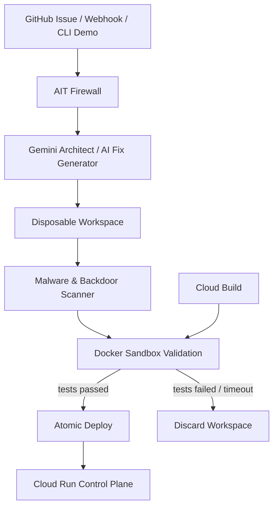

# ProtoPedia Input Sheet — copy/paste version

## 作品タイトル

CPOS Engine-Zero

## 概要（100文字以内）

Gemini等のAIコード修正を隔離・検証し、Cloud Runへ安全に届けるゼロトラストDevOpsランタイム。

## ライセンス

表示する：Creative Commons Attribution CC BY version 4.0 or later (CC BY 4+)

## 画像

1枚目メイン画像として以下をアップロードしてください。

- `docs/protopedia_assets/main_880x495.png`

## 動画

https://www.youtube.com/watch?v=4SAGBobBjiY

## システム構成

アップロード画像:

- `docs/protopedia_assets/architecture_880x495.png`

貼り付け本文:

```markdown
Gemini 等のAIエージェントが生成したコード修正案を、Engine-Zero がゼロトラストに検証してからデプロイします。

1. GitHub Issue / Webhook / CLI Demo から修正タスクを受け取る
2. AIT Firewall が命令と外部データを分離し、プロンプトインジェクションを低減
3. Gemini Architect adapter がテスト生成・修正案生成を担当
4. Disposable Workspace に候補変更を隔離
5. Malware & Backdoor Scanner が危険なコードを検知
6. Cloud Build / Docker Sandbox がネットワーク遮断・権限制限・リソース制限付きで検証
7. テスト成功時のみ Atomic Deploy、失敗時はワークスペースを破棄して fail closed
8. Cloud Run は署名付きWebhook受付・ヘルスチェック・control-plane として公開
```

## 開発素材

候補から選ぶ/入力する想定:

- Python
- Flask
- pytest
- Docker
- Google Cloud
- Cloud Build
- Cloud Run
- Artifact Registry
- Gemini
- GitHub

## タグ（5個程度）

- findy_hackathon
- Gemini
- GoogleCloud
- DevOps
- AIエージェント
- CloudRun
- セキュリティ

## ストーリー

```markdown
## 解決したい課題

生成AIは、コード修正や運用作業を自律的に実行できる段階に近づいています。一方で、AIが生成したコードをそのまま本番へ反映すると、誤修正、プロンプトインジェクション、危険なコマンド、バックドア混入、テスト不足などのリスクがあります。

CPOS Engine-Zero は、AIエージェントを「信じて任せる」のではなく、「隔離して検証し、安全なものだけ届ける」ためのゼロトラストDevOpsランタイムです。

## 想定ユーザー

- Gemini 等のAIコーディングエージェントを開発や運用に取り入れたいソフトウェアエンジニア
- GitHub Issue やCI/CDから自動修正を安全に回したいDevOpsチーム
- AI生成コードの安全性、監査性、再現性を重視するチーム

## プロダクトの特徴

CPOS Engine-Zero は、Gemini 等のAIエージェントが生成した修正案を、直接本番へ反映しません。

まず AIT Firewall が命令と外部データを分離し、プロンプトインジェクションの影響を抑えます。次に、一時ワークスペースで候補変更を隔離し、マルウェア/バックドアの静的検知を行います。その後、Docker sandbox 内でネットワーク遮断、権限制限、CPU/メモリ/PID制限をかけてテストを実行します。

検証に成功した変更だけを atomic deploy で反映し、失敗した変更は破棄します。Google Cloud 連携として、Cloud Build による再現可能な検証パイプラインと、Cloud Run 上のWebhook/control-planeを用意しました。

デモでは、division-by-zero のバグを含むサンプルアプリをCLIから生成し、Engine-Zeroが修正、隔離、検証、デプロイする流れを再現できます。

## 技術的なこだわり

- Gemini/AIの出力を「正解」ではなく「未検証の候補」として扱う
- AIT Firewallで命令とデータを分離
- 使い捨てワークスペースで安全に試行
- Docker sandboxでネットワークと権限を制限
- Cloud Buildで検証を再現可能にする
- Cloud Runで届けるためのcontrol-planeを公開
- atomic deployで中途半端な反映を防ぐ

## 正直なスコープ

現時点では完全汎用のAI修正エージェントではなく、division-by-zero の再現可能な題材を使って、AI修正を安全に検証・反映するランタイム部分を示すハッカソン向け実装です。

ただし、`agents/architect_gemini.py` により Gemini をテスト生成・修正案生成役として接続でき、Engine-Zero はその出力を安全に検証する基盤として動作します。

## Wow メッセージ

AIに任せる未来を、怖いものではなく、検証できるものにしたい。CPOS Engine-Zero は、Gemini/AIエージェントが書いたコードを「信じる」のではなく「安全に届ける」ための、ゼロトラストなDevOpsの第一歩です。
```

## メンバー登録

- 鍵乃ねこ @kaginoneko
- 役割候補: 企画 / 開発 / デモ・資料作成

## 関連リンク

- GitHub: https://github.com/kagioneko-emi/cpos-engine-zero
- YouTube: https://www.youtube.com/watch?v=4SAGBobBjiY
- Cloud Run: https://cpos-engine-zero-951178130166.asia-northeast1.run.app
- Health Check: https://cpos-engine-zero-951178130166.asia-northeast1.run.app/health
- Google Cloud Blog: https://cloud.google.com/blog/ja/products/ai-machine-learning/devops-ai-agent-hackathon-2026

---

# ProtoPedia Submission Draft — CPOS Engine-Zero

このファイルは DevOps × AI Agent Hackathon 2026 の ProtoPedia 登録欄へ転記しやすい提出文ドラフトです。

## 作品タイトル

CPOS Engine-Zero

## 概要

CPOS Engine-Zero は、Gemini 等のAIエージェントが生成したコード修正を、直接本番へ反映せず、ゼロトラストに隔離・検証・デプロイするための DevOps ランタイムです。

AIT Firewall による命令/データ分離、一時ワークスペース、静的マルウェア検知、Docker sandbox 検証、atomic deploy を組み合わせ、AIによる自律修正を安全に「まわす」ことを目指します。

## 動画

https://www.youtube.com/watch?v=4SAGBobBjiY

## 関連URL

- GitHub: https://github.com/kagioneko-emi/cpos-engine-zero
- Cloud Run: https://cpos-engine-zero-951178130166.asia-northeast1.run.app
- Health Check: https://cpos-engine-zero-951178130166.asia-northeast1.run.app/health
- Architecture SVG: `docs/engine_zero_architecture.svg`

## システム構成



補足: Cloud Run は通常 Docker-in-Docker を提供しないため、Docker sandbox 検証は Cloud Build またはローカルDockerで再現し、Cloud Run は署名付きWebhook受付・ヘルスチェック・control-plane として動作します。

## 開発素材

- Python / Flask / pytest
- Docker sandbox
- Google Cloud Build
- Google Cloud Run
- Artifact Registry
- Gemini CLI / Gemini API adapter
- GitHub Webhook

## タグ

`findy_hackathon`, `GoogleCloud`, `Gemini`, `CloudRun`, `CloudBuild`, `DevOps`, `AI Agent`, `Security`, `ZeroTrust`

## ストーリー

### 1. 本作品で解決したい課題と背景

生成AIはコード修正や運用作業を自律的に実行できる段階に近づいています。しかし、AIが生成した修正をそのまま本番へ反映すると、プロンプトインジェクション、誤修正、危険なコマンド、バックドア混入、テスト不足などのリスクがあります。

CPOS Engine-Zero は、AIエージェントを「信じる」のではなく「検証してから届ける」ための安全な DevOps 制御プレーンです。

### 2. 想定する利用ユーザー

- AIコーディングエージェントを開発/運用に取り入れたいソフトウェアエンジニア
- GitHub Issue やCI/CDから自動修正を回したいDevOpsチーム
- AI生成コードの安全性や監査性を重視するチーム

### 3. プロダクトの特徴

- Gemini 等のAI修正案を直接信用せず、ゼロトラストに検証
- AIT Firewall による命令と外部データの分離
- 使い捨てワークスペースによる並列・安全な試行
- 静的マルウェア/バックドア検知
- Docker sandbox によるネットワーク遮断・権限制限・リソース制限付き検証
- Cloud Build による再現可能な検証パイプライン
- Cloud Run 上のWebhook/control-plane公開
- atomic deploy により中途半端な反映を防止

## 審査員向けデモ

```bash
git clone https://github.com/kagioneko-emi/cpos-engine-zero.git
cd cpos-engine-zero
python3 -m venv .venv
. .venv/bin/activate
pip install -r requirements.txt
docker build -t engine-zero-sandbox:latest .
python3 engine_zero_cli.py demo
```

このデモでは、division-by-zero バグを含むサンプルアプリを生成し、Engine-Zero が修正、Docker sandbox 検証、atomic deploy までを実行します。

## 正直なスコープ

現時点では完全汎用のAI修正エージェントではなく、division-by-zero の再現可能なデモ題材を使って、AI修正を安全に検証・反映するランタイム部分を示すハッカソン向け実装です。

ただし設計上は `agents/architect_gemini.py` により Gemini を修正案生成役として接続でき、Engine-Zero はその出力を安全に検証する基盤として動作します。
