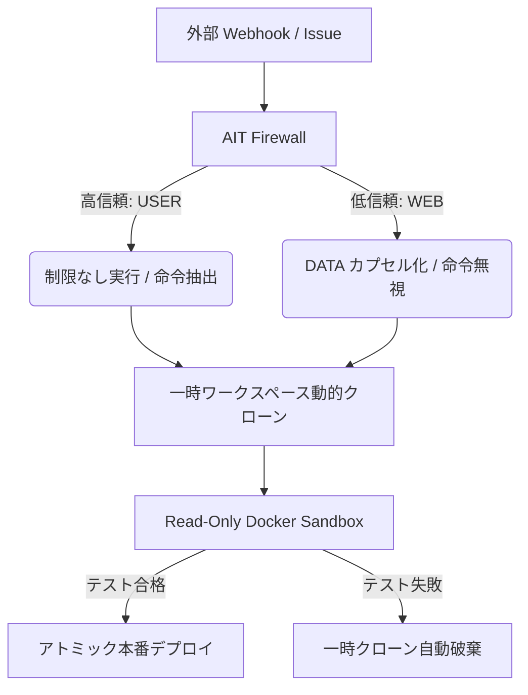

# CPOS Engine-Zero ＋ AIT Firewall: 企業向けセキュアAIエージェント仕様書

本仕様書は、企業実務への自律型AIエージェント（DevOps / コード自動修正）の導入における「セキュリティの盾（ゼロトラスト）」と「開発の自由（柔軟な命令実行）」の共存を定義したホワイトペーパーです。

---

## 🛡️ 1. 設計思想: 「隔離と制限」による自由の担保

従来のAIエージェント防御（入力フィルタ方式）は、少しでも怪しい単語があるだけでAIの実行を止めてしまい、開発者の自由度（指示のしやすさ）を大きく削いでいました。
Engine-Zero は **「検知して止める」のではなく「権限を分離して隔離実行する」** 設計を採用しています。

---

## 🔑 2. セキュリティ機能マトリクス

### ① AIT Firewall による「入力境界分離」
* **堅牢性:** `SRC:USER` (高信頼・指示) と `SRC:WEB` (低信頼・データ) を完全に分離。制御トークン（`</s>` や `<|im_start|>` 等）を無効化し、大文字小文字混在の終了タグエスケープ（`</DaTa>` ➔ `&lt;/data&gt;`）を徹底。
* **自由度:** フィルタで入力を拒否しないため、ユーザーは任意の要件（例: `ゼロ除算時に inf を返す` 等のセキュリティ的に過敏なキーワード）を自由にIssueに含めて指示できます。

### ② 一時ワークスペースの「動的クローン」
* **堅牢性:** Webhook受信ごとに、本番リポジトリを `target_app_tmp_<UUID>` へクローン。他の並列実行タスクや本番リポジトリと完全に分離。
* **自由度:** スレッドロック（排他制御）が不要なため、複数の開発者が同時に並列で異なる修正命令をAIに投げることが可能です。

### ③ 超隔離（ro ＋ ネットワーク遮断 ＋ 特権剥奪）Docker サンドボックス
* **堅牢性:** 自動修正されたコードの検証時、コンテナに対し以下の厳格な制限を強制します：
  - 一時ディレクトリを**読み取り専用（`:ro`）でマウント**。
  - **`--network none`**: ネットワークアクセスを完全無効化し、リバースシェルや認証情報の外部流出を物理的に防止。
  - **`--cap-drop=ALL`**: 全カーネル特権を剥奪し、コンテナエスケープ脆弱性によるホスト乗っ取りを困難化。
  - **`--memory 512m` / `--cpus 0.5` / `--pids-limit 50`**: リソース制限により、コンテナ内での無限ループや Fork Bomb DoS 攻撃からホストを防御。
* **自由度:** 隔離環境内でフル機能の `pytest` や静的解析を実行できるため、エージェントは高度な言語機能や外部ライブラリを自由に使用してテストを行えます。

### ④ ポータブルな静的マルウェアスキャン (Lightweight Anti-Malware Gate)
* **堅牢性:** テスト検証前に、エージェント側でコード全体の静的スキャン（シグネチャ照合）を実行。Webシェルやバックドア（`eval`/`exec`/`os.system`）、難読化された圧縮/エンコードペイロード、不審なネットワークソケット接続などを自動検知してブロック。
* **自由度:** 外部のウイルススキャンエンジン（ClamAV等）に依存せずポータブルに動くため、コンテナ環境や開発環境を問わず常に一貫したマルウェア流入ガードが働きます。

### ⑤ アトミックな検証済みデプロイ＆ロールバック
* **堅牢性:** テストが 100% 合格した場合のみ、修正コードを本番へ反映。失敗時、またはタイムアウト（30秒）発生時は、コンテナを `docker kill` して一時ワークスペースを単に `shutil.rmtree` で一括削除。
* **自由度:** AIがどれだけ「実験的（Speculative）」な修正コードを書いても、本番環境の破壊（リソース漏洩やCPUロック）を恐れる必要がありません。

---

## 📈 3. 企業導入時のメリット (ROI)

1. **AIサプライチェーン攻撃の防止:**
   外部のGitHub Issue等に悪意ある命令（プロンプトインジェクション）が投稿されても、AIT Firewallが自動検知して `SRC:WEB` として無害化データ処理するため、エージェントが乗っ取られてコードを不正修正される心配がありません。
2. **完全なる監査証跡 (Hash Chain Audit Log):**
   [cpos/core.py](file:///home/mayutama/cpos_sandbox_company/cpos/core.py) による SHA-256 ハッシュチェーンによって、AIエージェントの全行動履歴が改ざん不可能なログとして追記され、監査（Compliance）要件を満たします。
